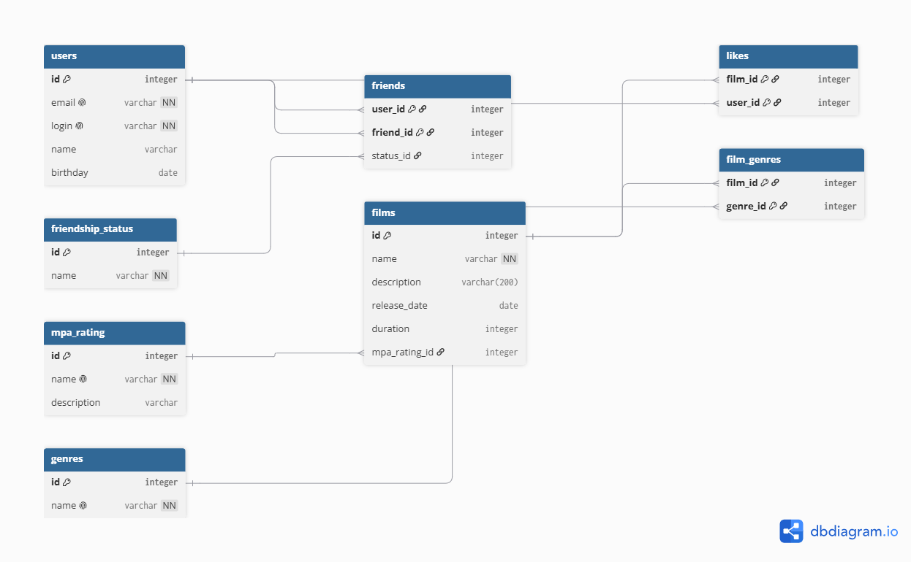

# java-filmorate
Template repository for Filmorate project.

# Схема базы данных Filmorate



## Пояснение к схеме

База данных спроектирована с учетом третьей нормальной формы (3NF):
* **users** — содержит основные данные учетных записей пользователей.
* **films** — содержит данные о фильмах и ссылается на таблицу возрастных рейтингов (`mpa_rating`).
* **genres** и **mpa_rating** — справочные таблицы.
* **film_genres** — связующая таблица «многие-ко-многим» для связи фильмов и их жанров.
* **likes** — связующая таблица «многие-ко-многим», хранящая лайки пользователей к фильмам.
* **friends** и **friendship_status** — таблица дружбы между пользователями со статусом подтверждения (неподтверждённая / подтверждённая).

---

## Примеры основных SQL-запросов

### 1. Получение всех фильмов с рейтингом MPA
```sql
SELECT f.id, f.name, f.description, f.release_date, f.duration, m.name AS mpa_rating
FROM films AS f
LEFT JOIN mpa_rating AS m ON f.mpa_rating_id = m.id;
```

### 2. Топ N наиболее популярных фильмов по количеству лайков
```sql
SELECT f.id, f.name, COUNT(l.user_id) AS likes_count
FROM films AS f
LEFT JOIN likes AS l ON f.id = l.film_id
GROUP BY f.id, f.name
ORDER BY likes_count DESC
LIMIT 10;
```

### 3. Получение списка подтверждённых друзей пользователя (например, id = 1)
```sql
SELECT u.id, u.name, u.login, u.email
FROM users AS u
JOIN friends AS f ON u.id = f.friend_id
WHERE f.user_id = 1 AND f.status_id = 2;
```

### 4. Поиск общих друзей двух пользователей (id = 1 и id = 2)
```sql
SELECT u.id, u.name, u.login
FROM users AS u
JOIN friends AS f1 ON u.id = f1.friend_id AND f1.user_id = 1 AND f1.status_id = 2
JOIN friends AS f2 ON u.id = f2.friend_id AND f2.user_id = 2 AND f2.status_id = 2;
```

### 5. Получение жанров для конкретного фильма (например, film_id = 1)
```sql
SELECT g.id, g.name
FROM genres AS g
JOIN film_genres AS fg ON g.id = fg.genre_id
WHERE fg.film_id = 1;
```